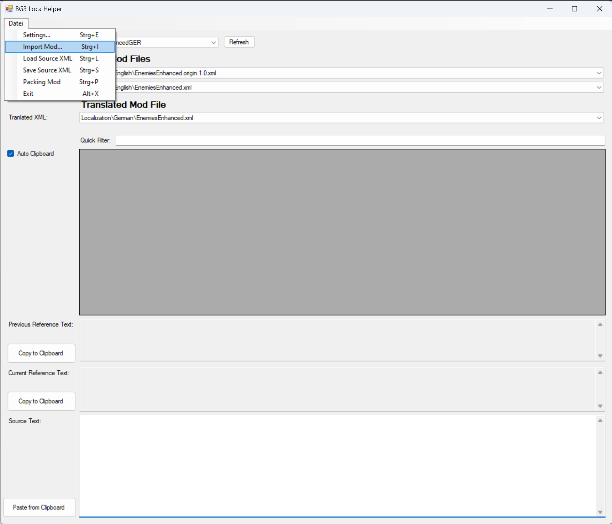
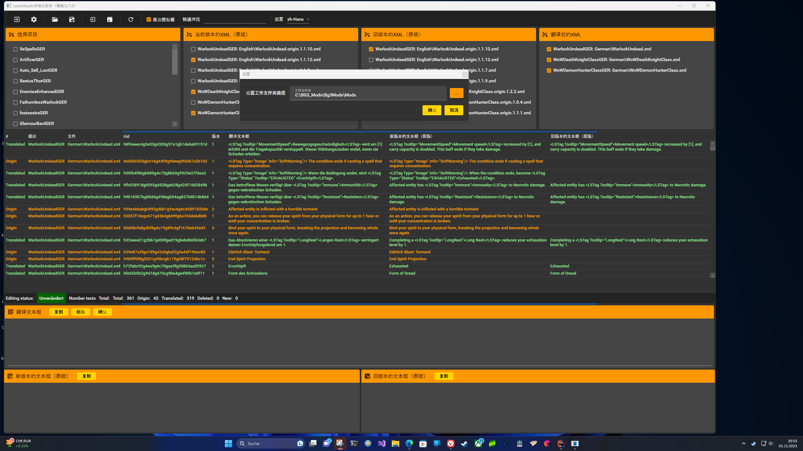

# Baldurs Gate 3 Loca Helper

<!-- TOC -->
* [Baldurs Gate 3 Loca Helper](#baldurs-gate-3-loca-helper)
  * [Features](#features)
  * [Screenshot](#screenshot)
<!-- TOC -->

Einfaches Werkzeug, um die für die Lokalisierung benötigten Dateien
schnell und einfach zu bearbeiten.

Die Bearbeitung der XML-Dateien erfolgt im Localization-Ordner des jeweiligen Moduls unter Angabe eines Verweises auf die Original-XML-Datei.
Diese dient zur Kontrolle der bereits übersetzten Texte.

Die Arbeitsgrundlage ist ein Ordner - Workspace genannt - in dem eine Sammlung verschiedener Mods bearbeitet werden kann.

Alles, was für die Erstellung einer Translation Mod benötigt wird, ist onboard und muss nicht extra beschafft werden.
Das bedeutet, dass JEDER, ohne eine Zeile programmieren zu müssen, damit eine Translation Mod erstellen kann.
und für den Upload in Nexusmod verpacken kann... mit einem Werkzeug.

## Features
Folgendes Features sind z.Zt. in der App vorhanden:

- Import einer Mod Pak-Datei und umwandeln in eine neue Translations Mod
- Bearbeitung der Lokalisierungsdateien im Format XML
- Vergleich der Texte mit der aktuellen und einer vorherigen originalen Lokalisierungsdatei
- Einmergen der Änderungen aus den originalen Lokalisierungsdateien
- Automatisches speichern der Translation datei - und NUR dieser(!) - in das loca-Format
- Speichern der Translation Mod in Zip-Format (Nexusmod upload kompatibel)

## Screenshot

Hier ein parr Screenshot, um die Arbeitsweise des Programmes zu dokumentieren.





Beim ersten Start der App oder im Menü Punkt "Settings" **MUSS** dieser eingestellt werden: 


Die Struktur des Ordner **MUSS** folgenden Aufbau haben:

```
<ModRootFolder>
    <ModFolder>
        <Work>
            <Default Mod Structure>
```

Hier ein Beispiel meines Wokspace Ordners:


