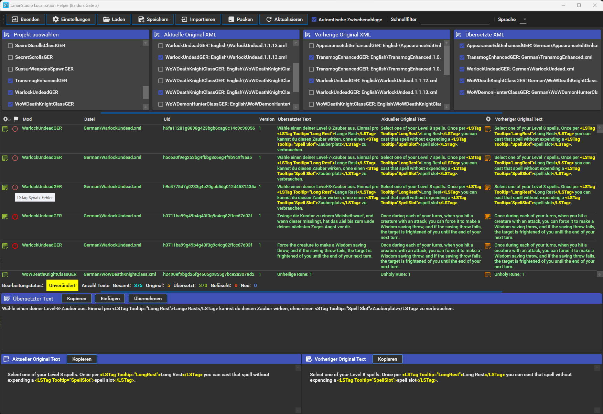
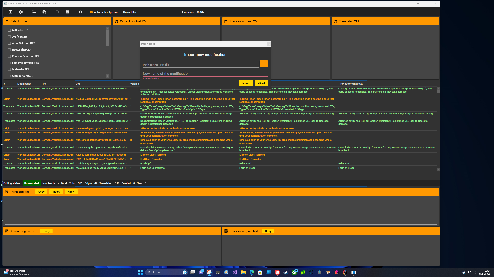
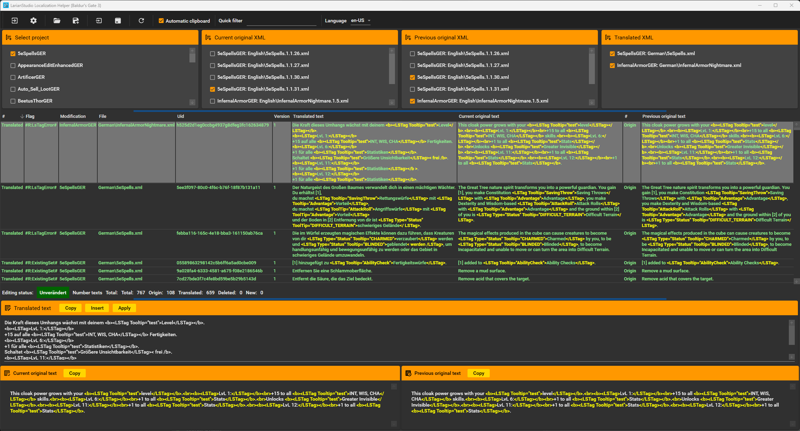

# Baldur's Gate 3 Localization Helper

<!-- TOC -->
* [Baldur's Gate 3 Localization Helper](#baldurs-gate-3-localization-helper)
  * [Features](#features)
  * [Configuration](#configuration)
  * [Screens version 3.0](#screens-version-30)
<!-- TOC -->

Simple tool to quickly and easily edit the files needed for localization
quickly and easily.

The XML files are edited in the localization folder of the respective module with a reference to the original XML file.
This is used to check the already translated texts.

The working base is a folder - called Workspace - in which a collection of different mods can be edited.

Everything needed to create a translation mod is onboard and does not have to be obtained separately.
This means that ANYONE, without having to program a line, can use it to create a Translation Mod.
And can package it up for upload to Nexusmod.... with one tool.

## Features

***The following features are currently available in the app:***

- Edit texts of several mods simultaneously
- Import a modification package (.PAK file) and convert it into a new translation mod.
- Edit localisation files without XML format in an editor
- Quick search with filtering of data in the table
- Compare texts with the current and a previous original localisation file
- Apply changes from the original localisation file
- Automatic saving of the translation file - and ONLY this(!) - in loca format
- Check LSTag tooltips for syntactical correctness
- Recognise duplicate entries
- Remove data records (delete button)
- Export the translation mod in zip format (Nexusmod upload compatible)
- Localisation of the application (currently: German, English, Chinese traditional/simple)

## Screens version 3.0
Previews of the next version completely refactored with Wpf.

Screenshot 10 

Screenshot 11 

Screenshot 12 

Screenshot 3 

Screenshot 4 

Screenshot 7 

Screenshot 8 


## Configuration
At the first start of the app or in the menu item "Settings" **MUST** be the wokspace:


The structure of the folder **MUST** have the following structure:

```
<ModRootFolder>
    <ModFolder>
        <Work>
            <Default Mod Structure>
```

Here is an example of my wokspace folder:


