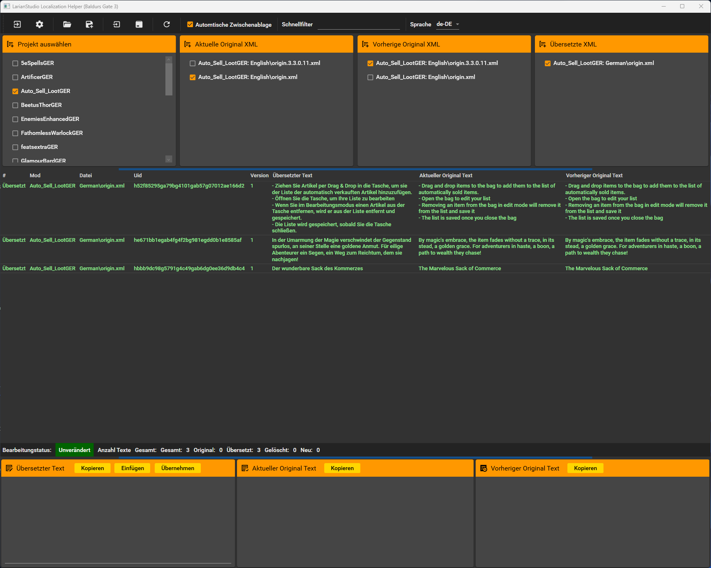

# Baldurs Gate 3 Loca Helper

Einfaches Werkzeug, um die für die Lokalisierung benötigten Dateien
schnell und einfach zu bearbeiten.

Die Bearbeitung der XML-Dateien erfolgt im Localization-Ordner des jeweiligen Moduls unter Angabe eines Verweises auf die Original-XML-Datei.
Diese dient zur Kontrolle der bereits übersetzten Texte.

