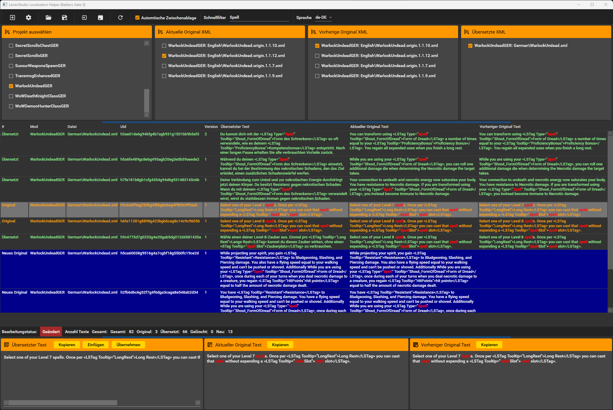

# Baldurs Gate 3 Loca Helper

Einfaches Werkzeug, um die für die Lokalisierung benötigten Dateien
schnell und einfach zu bearbeiten.

Die Bearbeitung der XML-Dateien erfolgt im Localization-Ordner des jeweiligen Moduls unter Angabe eines Verweises auf die Original-XML-Datei.
Diese dient zur Kontrolle der bereits übersetzten Texte.

## Release 2.0.1
Das Zusammenführen von Änderungen aus Mod-Updates wird nun unterstützt.
Neue Texte werden hinzugefügt, sobald der Text geändert wurde.
Nicht mehr vorhandene Texte werden beim Speichern gelöscht.

## Release 2.1.0
Mit 'Auto Clipboard' kann das automatische kopieren in die Zwischenablage beim Zeilenwechsel abgeschaltet werden.
Mehrzeilige Daten werden jetzt auch im Grid so angezeigt.
Ausserdem ist jetzt eine Schnellfilterunktion eingebaut worden.

