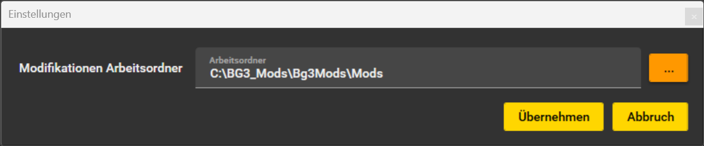

# Baldur's Gate 3 Localization Helper

<!-- TOC -->
* [Baldur's Gate 3 Localization Helper](#baldurs-gate-3-localization-helper)
  * [Features](#features)
  * [Configuration](#configuration)
  * [Screens version 3.0](#screens-version-30)
<!-- TOC -->

Simple tool to quickly and easily edit the files needed for localization
quickly and easily.

The XML files are edited in the localization folder of the respective module with a reference to the original XML file.
This is used to check the already translated texts.

The working base is a folder - called Workspace - in which a collection of different mods can be edited.

Everything needed to create a translation mod is onboard and does not have to be obtained separately.
This means that ANYONE, without having to program a line, can use it to create a Translation Mod.
And can package it up for upload to Nexusmod.... with one tool.

## Features

***The following features are currently available in the app:***

- Importing a mod pak file and converting it to a new translations mod
- Editing localization files in XML format
- Comparison of texts with the current and a previous original localization file
- Incorporating the changes from the original localization files
- Automatic saving of the translation file - and ONLY this(!) - into loca format
- Saving the translation mod in zip format (Nexusmod upload compatible)

***Features of the new version:***
- Localization (Currently: German, English, Chinese)
- Performance enhancement in rendering
- Multi mod editing
- Quicksearch display in table and text fields

## Configuration
At the first start of the app or in the menu item "Settings" **MUST** be the wokspace:


The structure of the folder **MUST** have the following structure:

```
<ModRootFolder>
    <ModFolder>
        <Work>
            <Default Mod Structure>
```

Here is an example of my wokspace folder:


## Screens version 3.0
Previews of the next version completely refactored with Wpf.


